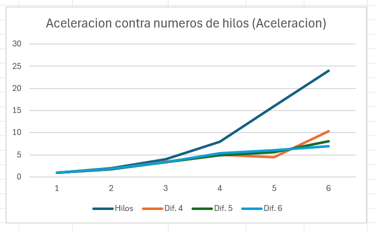
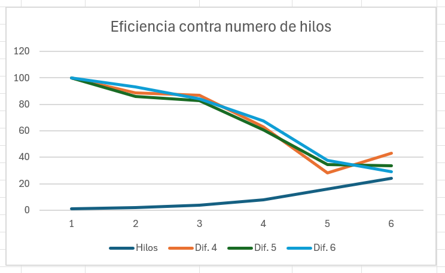
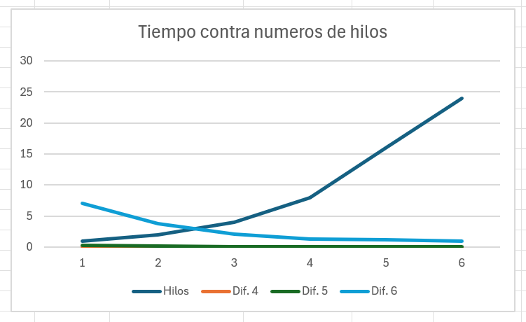

## 7. Evaluación de desempeño

### 7.1. Comparativa entre ejecución secuencial y paralela

Para medir la ventaja del paralelismo se selló el mismo bloque con distinto número de hilos y distintas dificultades. La versión de un hilo actúa como línea base (secuencial) y las demás como versiones paralelas. La aceleración (*speedup*) indica cuántas veces más rápido va cada versión paralela respecto a la secuencial.

| Difficulty | Threads | AvgTimeSeconds | AvgHashRate | Speedup | Efficiency |
|:----------:|:-------:|---------------:|------------:|--------:|-----------:|
| 4 | 1  | 0.03   | 1801636  | 1     | 100  |
| 4 | 2  | 0.0169 | 3209081  | 1.776 | 88.8 |
| 4 | 4  | 0.0086 | 6145029  | 3.474 | 86.9 |
| 4 | 8  | 0.0059 | 8706936  | 5.05  | 63.1 |
| 4 | 16 | 0.0067 | 9381315  | 4.482 | 28   |
| 4 | 24 | 0.0029 | 9043484  | 10.372 | 43.2 |
| | | | | | |
| 5 | 1  | 0.2876 | 1600217  | 1     | 100  |
| 5 | 2  | 0.1675 | 2735930  | 1.717 | 85.9 |
| 5 | 4  | 0.0866 | 5012425  | 3.321 | 83   |
| 5 | 8  | 0.0592 | 8063582  | 4.858 | 60.7 |
| 5 | 16 | 0.0518 | 9358135  | 5.55  | 34.7 |
| 5 | 24 | 0.0355 | 11241119 | 8.102 | 33.8 |
| | | | | | |
| 6 | 1  | 7.0221 | 1511493  | 1     | 100  |
| 6 | 2  | 3.7706 | 2812639  | 1.862 | 93.1 |
| 6 | 4  | 2.0839 | 5140302  | 3.37  | 84.2 |
| 6 | 8  | 1.297  | 8093228  | 5.414 | 67.7 |
| 6 | 16 | 1.1679 | 9275479  | 6.013 | 37.6 |
| 6 | 24 | 1.0048 | 10618532 | 6.988 | 29.1 |

## 7.2. Métricas: tiempo, eficiencia y escalabilidad

Las métricas registradas son el tiempo de sellado, la velocidad en MHash/s, la aceleración y la eficiencia (aceleración dividida entre el número de hilos). En conjunto muestran cómo evoluciona el rendimiento a medida que se añaden recursos.

### Aceleración (*Speedup*)

La aceleración aumenta con el número de hilos, confirmando la ventaja del paralelismo. El crecimiento es pronunciado hasta los 8 hilos y luego se atenúa, lo que evidencia los rendimientos decrecientes al superar la capacidad real del procesador.

### Eficiencia

La eficiencia parte del 100% con un hilo y desciende progresivamente al añadir más, porque los hilos compiten por un número limitado de núcleos físicos. Esto ilustra el concepto de rendimientos decrecientes: cada hilo adicional aporta menos que el anterior.

### Tiempo de sellado

El tiempo de sellado se reduce drásticamente al añadir hilos: en la dificultad 6 pasa de más de 7 segundos con un solo hilo a aproximadamente 1 segundo con 24 hilos. Esta gráfica traduce la ventaja del paralelismo a términos concretos de tiempo real.

